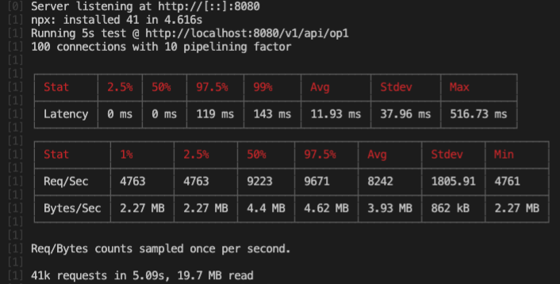
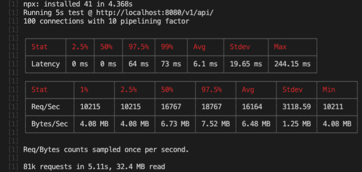
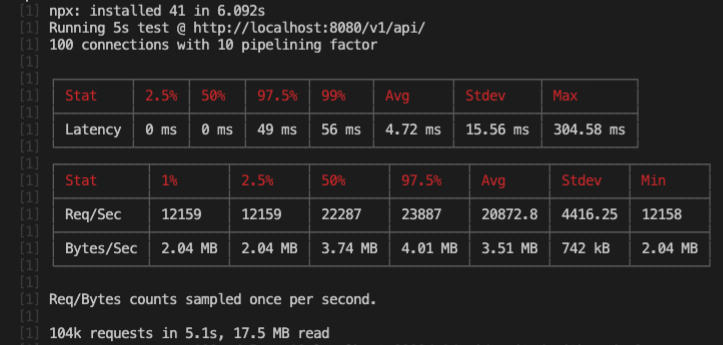

# Benchmarks

- Machine: macOS Catalina | 2,2 GHz Quad-Core Intel Core i7 | 16GB.
- Run: 2020-05-04T07:41:48.590Z
- Node: v12.3.1

## bautajs/express

A benchmark test with the bautajs implementation of express.

```npm run benchmark-express```



## batuajs/fastify

A benchmark test with the bautajs implementation of fastify.

```npm run benchmark-fastify```



## batuajs/core

A benchmark test with the bautajs implementation using only the core with NodeJS directly. Take in account that a lot of features from the frameworks such body parser are not available.

```npm run benchmark-core```

