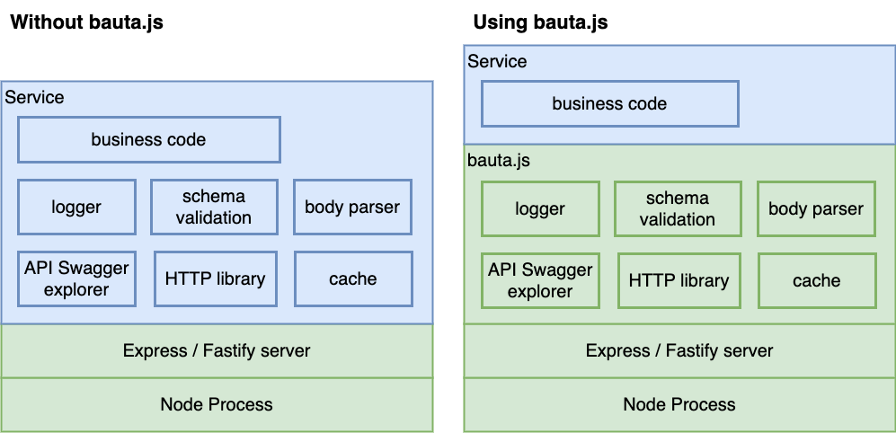

# bauta.js and developer experience

## Audience of this document

This document is for anyone that is starting to learn about bauta.js library. For example a developer that has just discovered bauta.js or a techical lead in a team that is wondering whether bauta.js could be helpful to them or cover their needs.

## Reason for this document

The goal of this document is to help you to answer the question: "Do I want to use bauta.js?" and provide you a starting point answering the question "How do i get started with bauta.js?".

We hope that by reading this document, that should not take more than 15 or 20 minutes, you can review quickly what is bauta.js about and let you determine if it could be helpful to you.

This document tries to convey the model used by bauta.js at high level. This is to speed up the process of understanding how bauta.js is used and if it is useful to you.
### What this document is *not*

- This document does not list bauta.js capabilities or features. 
- This document is not a tutorial on the library itself, nor it is a hands-on. You can have that information in the documentation starting [here](../../README.md).
- Since this is not a tutorial, the explanations in this section differ a bit from the common pattern "piece of code" --> "what stuff does each line". 

## What is the purpose of bauta.js?

Bauta.js main goal is to provide a layer of utilities and abstractions between a low level library server and your server code. 

To do his job, bauta.js can be used on top of two low level frameworks: express or fastify. Thus, bauta.js itself is an utility library that provides a set of useful abstractions and glues common patterns that cover most of the use cases related to the creation of REST API's and middlewares. 

## Ideal Scenario

The ideal scenario where bauta.js shines is in delivering REST API's and especially using micro-services architecture. This allows you to use and reuse the bauta.js abstractions in different services and gain back the time and effort that you might have invested in learning to use it. 

Thus, the ideal scenario could consist:

- A set of one or more services, every one of them with its own business needs. Following the micro-services architecture you deploy each of those services independently.
- Those same set of services should share a common set of technical requirements in terms of security, token management, external calls management, error management, logging, etc.

### What about other scenarios?

Depending on the scenario is up to you to decide whether bauta.js is useful to you or not. We hope that this document can provide information to easily assist you in that decision.

For example, if you are exposing a GraphQL server then you can decide to use directly a GraphQL server like Apollo or Mercurius and you may think that you do not need bauta.js [^1].

Another case would be if your REST API is an entire monolith. Is it worth it to learn bauta.js if you are maintaining an already big monolith? As usual, it depends, but the advantage of having your monolith in bauta.js is that it should be easier to separate it in different micro-services if you have the need to do so in the future. 

## The key concepts of bauta.js

### StepFunction: the working unit of bauta.js

StepFunction is a function in bauta.js that conforms to the following signature:

- it has three input parameters: prev, context and bauta.js instance itself.
- it returns a value or a promise that would eventuall return a value.

#### Why it is so important?

Because not only the application code uses this as a type. Bauta.js itself uses this signature for its internal execution. Even bauta.js more advanced abstractions are in turn or return a StepFunction. And finally, because almost all the logic defined in terms of endpoints are a combination of one or more StepFunctions (check pipeline for more details).

One could Think about the code of a bauta.js application as a bunch of StepFunctions that are run one after another or in parallel and whose results are passed from one to the next defined in your code. 

#### What are the main parts of an StepFunction?

These are three input parameters of an StepFunction:

- prev: is the previous value. this always take the value (or values) returned by the previous StepFunction. This value can be undefined, usually because is the the first StepFunction and there is none previously.

- context: this is the context of the request being processed. You can think of this parameter as the session of the request [^2].

- bautaJSInstance: this object represents the bauta.js server instance itself. The most used field of this object is called staticConfig and has all the variables loaded by bauta.js at startup time.

### Operation 

An operation is a type that abstracts a route definition. Initially, you may think of an Operation as the concept that glues together:
- a route or endpoint defined in your swagger
- if applicable, an schema that the operation has to conform to
- a business logic that handles the input from the request and generates a response to the caller together with any possible side effect


### Resolver 

Operations are usually defined together in a single file which is called resolver in bauta.js. Thus each entity can have its own resolver that logically aggregates related operations.


## An example 

Let's try to make an example to help understand these concepts. We want to implement an endpoint that calculates how much money driving between two points would cost. The business logic of our endpoint should do the following:

- from the incoming request call get the starting and destination points, and generate a request input to a service similar to Google's Distance Matrix API
- send that request to the service
- obtain the distance from the response from the previous request
- using that distance, call another service that returns the price in fuel that you would use
- return that value to the caller as the response of the incoming request

### bauta.js code structure

In bauta.js what we like to do is this:

- define a resolver that has the operation defined and that setups as its handler a pipeline.
- define a pipeline with a list of the steps required.

If you are reading this for the first time, it may seem hard to grasp what it is, but at code level is just he following:


```resolver.js ```
```js 
import { resolver } from '@axa/bautajs-core';
import { calculateGasolineCost  } from './calculator-pipeline';

export default resolver(operations => {
  operations['calculate-gasoline-cost'].setup(calculateGasolineCost);
});
```

```calculator-pipeline.js```
```js
import { pipe } from '@axa/bautajs-core';
import { getRequest } from '@axa/bautajs-fastify';

...

const calculateGasolineCost = pipe(
  generateDistanceRequest,
  sendCalculateDistanceMessage(),
  getDistance,
  sendFuelCostMessage(),
  generateResponse
);

```
Brief explanation:

- The file ```resolver.js``` sets for each operation the pipeline that implements the business logic.

- The file ```calculator-pipeline.js``` exports the pipeline that implements this business logic. This is done through the decorator function pipe, that has a list of StepFunctions. This allows for a very readable and testable logic, even when having more advanced cases with more complex decorators.

*Detail:* 
> The pipe decorator composes the business logic that will be run each time a request is processed from all the StepFunctions passed as arguments. In this list there can be references to any number of StepFunctions that will be run or, like in the example's datasources[^3] ```sendCalculateDistanceMessage``` and ```sendFuelCostMessage```, we might require a function that when run returns a StepFunction reference.


## Decorators

We use plenty of decorators in bauta.js. The main reason for this is to allow the editor to provide dynamic typings. But another is because they are useful to glue the code in a logic way (ressembling a bit functional programming).

Since this is not a tutorial, we will skip how and why they are used in each case. You have extensive documentation about decorators [here](../../README.md#decorators). 

Almost every concept in bauta.js has a decorator that is required to be used. For example:

| Concept | Decorator name |
|------------------------|-----------------------|
| StepFunction | step |
| Resolver | resolver |
| Pipeline | pipe | 

### Why has to be all wrapped in decorators?

It is a fair question and some of us when learning bauta.js have made it.

The short answer is to improve the developer experience.

The long answer is because:

- sometimes the decorators *are* mandatory, and it is easier to use them all the time.
- the decorators, even when optional, mark a function as belonging to a step or a pipeline, and help differentiate the code which is a step from normal functions.
- the decorators may provide helpful intellisense help[^4]

As an example, imagine you want to make a "guess" service to receive the value head or tail and then check if this guess is valid or not. Using bauta.js you might end with something similar to this:

```javascript

const guessPipeline = pipe(
  obtainCoin,
  getGuessResult,
  iif(isGoodGuess, youHaveWon, youHaveLost)
);

```
Using this pattern, every function has a single responsability and at the pipeline level, the code that glues the logic of the function can be understood easily just looking at the pipeline. 

Furthermore, you can create a pipeline and pipe it into another pipeline, which allows patterns for composing and reusing pipelines in more than one operation or services.

## Developer experience comparison 

Let's assume that you want to implement an API REST service. Regardless of its functional domain or its technical requirements, there are a few things that the service will need to do.

In the next diagram in the left side we convey these responsabilities if you do not use bauta.js.



We are not saying that your application code has to implement all those responsabilities from scrath. In fact it is almost sure that you will use libraries for that, but the point is that you will have those libraries as dependencies from your project and you will have to maintain those dependencies and the code that integrates them in your application. 

In comparison you can see that on the right side, with bauta.js, you have those responsabilities hidden inside bauta.js. You can use them as easily with your custom solution but your service has less boilerplate due to those common technical requirements and you can focus on your business code. 

### Small note about the diagram and fastify

While the diagram represents 100% a case using the express framework, it is not totally exact for a case using fastify. The reason is because fastify offers its own high performant schema validator and body parser. Thus, for the diagram in the right to be totally correct the body parser box should be inside fastify box and there should be up two schema validations boxes: one for bauta.js and the other for fastify that validates as well when parsing the request. 

Another way of seeing this is that when using fastify, bauta.js is used as plugin. In any case the message is the same: your application does not have to bother with schema validation or other technical details because is being done by the abstractions provided by bauta.js together with the chosen server framekwork.


[^1]: With bauta.js it is possible to expose a Mercurius graphql endpoint, but that is not a common scenario.

[^2]: To be precise the context extends the session of the low level library server and it has a few extra set of data and utilities.

[^3]: The two functions run in this example are datasources, which is a decorator that returns a StepFunction that executes a request to a third party API. You can check further details about datasources [here](../.././docs/datasources.md)

[^4]: This may depend on the editor used, whether you are using typescript or javascript and the code itself


