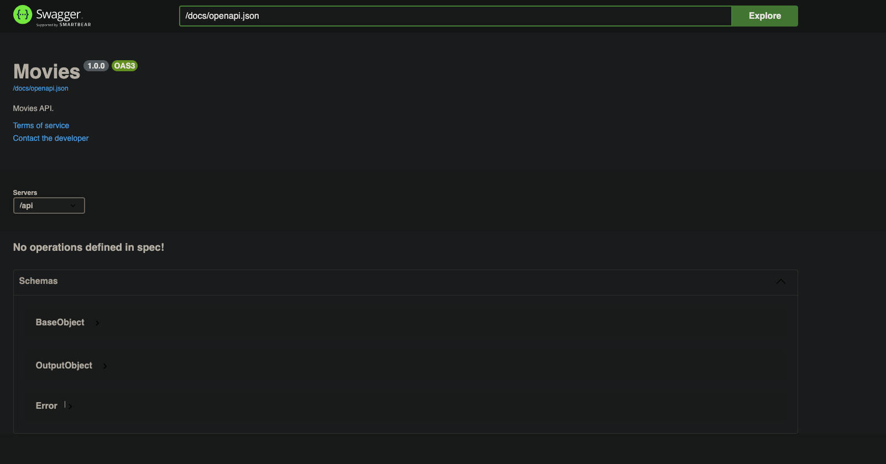

# Getting started

The goal of this section is to describe the main features of `bautaJS` with an example of a movies API and [tmdb](https://developers.themoviedb.org/3) as a source.

## Prerequisites
- NodeJS > 12.x
- npm > 6
- Basic knowledge of NodeJS
- Basic knowledge of [fastify](https://github.com/fastify/fastify) or [express](https://github.com/expressjs/express)
- Access to the internal AXA artifactory
- An API key from [tmdb](https://developers.themoviedb.org/3)

## DataSource used for this tutorial

The endpoints that we will consume from tmdb are (For the sake of the workshop we will skip the pagination on all endpoints):
  - ['/movie/top_rated'](https://developers.themoviedb.org/3/movies/get-top-rated-movies)
  - ['/genre/movie/list'](https://developers.themoviedb.org/3/genres/get-movie-list)
  - ['/movie/{tmdbId}/external_ids'](https://developers.themoviedb.org/3/movies/get-movie-external-ids)
  - ['/find/{external_id}'](https://developers.themoviedb.org/3/find/find-by-id)
  - ['/movies/{tmdbId}'](https://developers.themoviedb.org/3/movies/get-movie-details)
  - ['/movies/{tmdbId}/recommendations'](https://developers.themoviedb.org/3/movies/get-movie-recommendations)
  - ['/movies/{tmdbId}/reviews'](https://developers.themoviedb.org/3/movies/get-movie-reviews)
  - ['movie/${tmdbId}/rating'](https://developers.themoviedb.org/3/movies/rate-movie)

## Concepts summary

First of all let's clarify some concepts that we will use on all this tutorial, from the smallest part to the largest.

- StepFunction: An StepFunction is the individual element that together compose the pipeline. A pipeline is composed of Pipeline.StepFunction that are executed "step" by "step".
  An StepFunction have three input parameters:
    - The previous StepFunction value as first parameter. In the first StepFunction will be undefined.
    - The pipeline [ctx](../decorators-and-resolvers.md#Context), that is the context object that includes logger, id and data transmitted through all the pipeline.
    - The bautaJS instance in which the pipeline is plugin it.
- RestProvider: It references to a specific http/s request.
- Decorator: The decorators are helper StepFunctions that improve the developer experience and solve the most common problems in the implementation.
- Pipeline: A pipeline is a composition of StepFunctions.
- Operation: Is the equivalent of an endpoint controller and normally the name should match with the endpoint implemented operationId from the [OpenAPI definition](./movies-api.json).
- Resolver: A resolver is a group of operation definitions.

## Chapter 1 Install bauta + fastify + the rest datasource

- First, lets create an empty project with:

```console
mkdir bautajs-workshop
cd bautajs-workshop
npm init
```

- And install the basic things:
```console
  npm install fastify fastify-cli @bautajs/fastify @bautajs/core @bautajs/datasource-rest --save
```

## Chapter 2 Setup bautaJS + fastify cli

In this step we will initialize the our API.

- First copy/download the [OpenAPI definition](./movies-api.json) from this example to your root project directory.
- Then we will create our resolvers folder in which we will declare the operation resolvers.
- After that create a root file which will be our entry point `server.js`
- Inside the file we will need to instantiate our [bautaJS fastify plugin](../../packages/bautajs-fastify/Readme.md).
  To do that, if we look at the documentation it will be as easy as:
    - Define the fastify plugin and export it:
    ```js
      module.exports = (fastify, options, next) => {

        next();
      }
    ```
    - And register the [bautaJS fastify plugin](../../packages/bautajs-fastify/Readme.md) into the fastify instance with the options; apiDefinition (which references to this [OpenAPI definition](./movies-api.json)) and the resolvers path, that can be a glob path to the resolvers folder js files (path.resolve(__dirname, 'resolvers/**/*.js'))
- To end this part we will just create our start script on the `package.json` file with [fastify-cli](https://github.com/fastify/fastify-cli#start) referencing our server.js. By the sake of this tutorial we will start the server as debug mode, to do that add the following flag to the previous command `--l debug`.
- That's it, you can now start your server and access to the `Swagger explorer`.
```console
 npm start
 open http://localhost:3000/docs
```
You will see something like this, don't panic there are no endpoints because we didn't defined any operation.


- There also an important thing to do, the error handler, this will improve our output errors. To do that, check the [setErrorHandler](https://www.fastify.io/docs/latest/Server/#seterrorhandler) of fastify. There we will just log the error and map the error `message` and `statusCode`.
There is a particularity on this error handler that we must take in account, the [restProviders](../datasources.md) that we will manage on the next chapters will throw a [got error](https://github.com/sindresorhus/got/tree/v11.8.2#errors) knowing this we can map the [tmdb error response status_message](https://developers.themoviedb.org/3) to our error message specified on the [OpenAPI definition](./movies-api.json).

On the file `server.js` add:
```js
  fastify.setErrorHandler((error, request, reply) => {
    request.log.error(error);
    reply.status(error.statusCode || 500).send({
      message: error.message || error.response?.body?.status_message,
      statusCode: error.statusCode
    });
  });
```

## Chapter 3 implement the getMovies operation

To implement this operation we will need two things, the datasource from which the data will be fetched and the resolver in which the operation getMovies logic will be defined.

- First let's start with the datasource, for this there is no gold written rule on how to do it, but I recommend to create one file peer datasource, in this case, one file for the tmdb datasource. Let's call it `tmdb-datasource.js` and let's place it inside the resolvers folder along side the future resolver.

  `bautaJS` has a special tool to create http/s datasources, this tool is the [@bautajs/datasource-rest](../../packages/bautajs-datasource-rest/Readme.md) that at the end is a wrapper of a famous fetch library called [got](https://github.com/sindresorhus/got) but with some extra features. We will use the `restProvider` method to specify our requests to the `tmdb API`.
  ```js
   const { restProvider } = require('@bautajs/datasource-rest');
  ```
- Then as we will share some properties between all the `endpoints` on this `tmdb-datasource.js` it's recommended to create a [shared restProvider](../../packages/bautajs-datasource-rest/Readme.md#create-your-own-restprovider) with some common properties. If we look the documentation we can see that it's as easy as extend the provider.
```js
const tmdbProvider = restProvider.extend({
  prefixUrl: 'https://api.themoviedb.org/3',
  searchParams: {
    api_key: process.env.TMDB_API_KEY
  }
});
```
So `prefixUrl` and the query parameter `api_key` are common across all the services.
- Now we are ready to create the different services we will need for fullfil the `getMovies` operation.
For fill our `getMovies` operation we will assume that the equivalent service on `tmdb API` is ['/movie/top_rated'](https://developers.themoviedb.org/3/movies/get-top-rated-movies).
To create the service we will need to use our `tmdbProvider` to define the request and export it and check the ['/movie/top_rated'](https://developers.themoviedb.org/3/movies/get-top-rated-movies) signature. Check the autocomplete typings in order to know the function signature. At the end you will end with something like this:
```js
module.exports.getTopMovies = tmdbProvider(async client => {
  const body = await client.get('movie/top_rated');

  return body.results;
});
```
- Let's move to the resolver and implement the logic. For the moment we will only need to do one thing, call that provider we just exported.
  - Create a file called `movies-resolver.js` inside the resolvers, you can choose a better name :P.
  - Define and export the [resolver](../../decorators-and-resolvers.md).
  ```js
    const { resolver } = require('@bautajs/core');

    module.exports = resolver(operations => {

    });
  ```
  - To setup an operation you first need to check under the [OpenAPI definition](./movies-api.json) which is the `operationId` of the operation, in this case is called `getMovies`. Now, to define it just call the `.setup` method of the operation (You can find what methods the operation has once you define the operation name)
  ```js
    operations.getMovies.setup(() => {});
  ```
  - With this definition we are declaring that the response of this operation will be an empty object, to return back the response of the `tmdb` API we just plug in the provider we just created on the `tmdb-datasource.js` file. **Be aware of the artifacts types, `getTopMoviesProvider` is not an `StepFunction` by himself, you need to execute it before**
  ```js
    const { resolver } = require('@bautajs/core');
    const { getTopMovies } = require('./tmdb-datasource');

    module.exports = resolver(operations => {
      operations.getMovies.setup(getTopMoviesProvider());
    });
  ```
- Now, that's all let's try:
    Run the server (Replace ${mytmdbapikey} with your tmdb API KEY)

    ```console
      TMDB_API_KEY=${mytmdbapikey} npm start
    ```

    Call our operation endpoint (By default the exposed base path of your API is `api` and the endpoint signature can be found inside the [OpenAPI definition](./movies-api.json))

    ```console
        curl http://localhost:3000/api/movies/top-rated
    ```

    Ey! we see that the response is an empty object, Why?. To know why is this happening we need to go to our server logs, there we see that the error is the following one:
    ```console
    {"level":50,"time":xxxx,"pid":37109,"hostname":"xxx","reqId":"req-1","req":{"method":"GET","url":"/api/movies/top-rated","hostname":"127.0.0.1:3000","remoteAddress":"127.0.0.1","remotePort":59168},"res":{"statusCode":500},"err":{"type":"Error","message":"\"imdb_id\" is required!","stack":"Error: \"imdb_id\" is required!\n
    ```
    It's basically complaining that imdb_id is not part of the response but is required on the [OpenAPI definition](./movies-api.json), if we look at the response of the ['/movie/top_rated'](https://developers.themoviedb.org/3/movies/get-top-rated-movies) from tmdb API we can find that imdb_id is not there. Don't panic, if we have a little look at the tmdb API we can find that there is a endpoint in which we can get that ID for each movie, ['/movie/{movie_id}/external_ids'](https://developers.themoviedb.org/3/movies/get-movie-external-ids)
- Let's go back to our datasource file and create a new provider `getMovieImdbIdProvider` which will get the service ['/movie/{movie_id}/external_ids'](https://developers.themoviedb.org/3/movies/get-movie-external-ids).
  Take in mind that here we have a dynamic parameter which is the `movie.id`. This can be taken from the previous request of `getTopMoviesProvider` you can check the ['/movie/top_rated'](https://developers.themoviedb.org/3/movies/get-top-rated-movies) response signature for more information. We will end up with something like this:
  ```js
    module.exports.getMovieImdbIdProvider = tmdbProvider(async (client, movie) => {
      const body = await client.get(`movie/${movie.id}/external_ids`);

      return body.imdb_id;
    });
  ```
- Now let's start compositing the functions. Thinking on what we need we see that we should loop over every movie, get the IMDB_ID from the `getMovieImdbIdProvider` and set it on the movie object. For that, we can address to the `decorators` to use the [parallelMap](../../decorators/parallelMap) that does exactly what we need loop and map the object in "parallel". Arrived this point, to split responsibilities we will need to use one decorator more in order to have one function that gets the ImdbId from a movie id and another that set it into the movie object. The decorator we can use in this case is the [pairwise](../../decorators/pairwise) which will allow us to merge the actual value (the imdbId) and the previous value (the movie object) and plug both of them as an array in the next function where we can add the imdb id into the movie object.
  ```js
    const { resolver, parallelMap, pipe, pairwise } = require('@bautajs/core');
    const { getTopMoviesProvider, getMovieImdbIdProvider } = require('./tmdb-datasource');

    module.exports = resolver(operations => {
      operations.getMovies.setup(
        pipe(
          getTopMoviesProvider(),
          parallelMap(
            movies => movies,
            pipe(pairwise(getMovieImdbIdProvider()), ([movie, imdbId]) => ({ ...movie, imdb_id: imdbId }))
          )
        )
      );
    });
  ```
- Before rerunning again the API let's check on the [OpenAPI definition](./movies-api.json) what are the mandatory fields and mapped them as well. Comparing with the ['/movie/top_rated'](https://developers.themoviedb.org/3/movies/get-top-rated-movies) endpoint we can see that `tmdb_id` is also missing.
We can find that ID inside the ['/movie/top_rated'](https://developers.themoviedb.org/3/movies/get-top-rated-movies) response under the property `id`. Knowing this, follow the previous steps to create a reusable step function which with the given `movie` will set the `tmdb_id` property to it. A clue, is very similar to the one that adds the imdb_id into the movie object ;).

- Now, yes, if we rerun the API and do the curl:
    Run the server (Replace ${mytmdbapikey} with your tmdb API KEY)

    ```console
      TMDB_API_KEY=${mytmdbapikey} npm start
    ```

    Call our operation endpoint (By default the exposed base path of your API is `api` and the endpoint signature can be found inside the [OpenAPI definition](./movies-api.json))

    ```console
        curl http://localhost:3000/api/movies/top-rated
    ```
  Finally we get a json with the movies data!!. There is something you might notice, were are the extra fields from the `tmdb` response? Thanks to the openAPI schema we provided to `bautajs` we don't have to deal or worry about the extra fields, fastify serializer will delete it for you.

- But wait, there is something missing, the `genres` of the movies. Looking into the ['/movie/top_rated'](https://developers.themoviedb.org/3/movies/get-top-rated-movies) response, we see that this information can be retrieved from the field `genre_ids` and doing a simple gropBy with the genres on the request ['/genre/movie/list'](https://developers.themoviedb.org/3/genres/get-movie-list).

  As we know the process now, we can do this by:
    - Create a new provider on the `./tmdb-datasource` file to getting the movie genres list using the endpoint of ['/genre/movie/list'](https://developers.themoviedb.org/3/genres/get-movie-list), the provider name can be `getMovieGenresProvider`.
    - Thinking on how to do this in the more optimal way, we can guess that since getting the genres and getting the movies list are not dependent each other, we can simple join both ejecutions with the [parallel decorator](../../decorators/parallel).
    ```js
       parallel(
        getTopMoviesProvider(),
        getMovieGenresProvider()
      ),
    ```
    - Ey, but know we have a problem, as the result of a parallel `StepFunction` is an array of the two results, the next step we have implemented won't receive just the movies only, it will receive an array with the `[movies, genres]`. Due to that we need to modify the [parallelMap](../../decorators/parallelMap) selector function and indicate the correct array.

    ```js
      parallelMap(
        ([movies]) => movies,
    ```
    - Finally the only thing left is create our reusable `StepFunction` that will add the genres into the movie. This `StepFunction` should be part of the [parallelMap](../../decorators/parallelMap) pipeline, but if we try to add it as is we found that we can not get the genres list from anywhere, that's because in our [parallelMap](../../decorators/parallelMap) selector function we can only indicate over which array we want to loop. In this case we can use the feature of saving data into the [context](../decorators-and-resolvers.md#Context). Lets rewind a bit and modify our `parallel` implementation in order to save the `genres` into the [context](../decorators-and-resolvers.md#Context).

    ```js
     parallel(
        getTopMoviesProvider(),
        pipe(getMovieGenresProvider(),(genres, ctx) => {
          ctx.data.genres = genres
        })
      ),
    ```

    Now it's easy to get it back from any place we want on our pipeline. Also remember this [context](../decorators-and-resolvers.md#Context) object is only available during the request, therefore is not a global object. In order to not "contaminate" the reusable `StepFunctions`, we can simple do a previous step on our pipeline to prepare the input, in this case we need the `movie` and the `genres`

    ```js
          parallelMap(
            ([movies]) => movies,
            pipe(
              pipe((movie, ctx) => [movie, ctx.data.genres]),
              addTmdbIdToMovie,
              addMoviesWithImdb
            )
          )
    ```
    Then, we can create our reusable `StepFunction` `addGenresNamesToMovie` and plug in it into the pipeline as follow:
    ```javascript
          parallelMap(
            [movies] => movies,
            pipe(
              pipe((movie, ctx) => [movie, ctx.data.genres], addGenresNamesToMovie),
              addTmdbIdToMovie,
              addMoviesWithImdb
            )
          )
    ```

    If we try it know we can see that in the response the genres lists for each movie is populated!
      
    Run the server (Replace ${mytmdbapikey} with your tmdb API KEY)

    ```console
      TMDB_API_KEY=${mytmdbapikey} npm start
    ```

    Call our operation endpoint (By default the exposed base path of your API is `api` and the endpoint signature can be found inside the [OpenAPI definition](./movies-api.json))

    ```console
        curl http://localhost:3000/api/movies/top-rated
    ```

## Chapter 4 implement the getMovieById operation

At this point, you should have more or least a big picture on how `bautaJS` works, so we can continue to implement the second endpoint, the `getMovieById` operation.

If we check the equivalent of [OpenAPI definition](./movies-api.json) `getMovieById` response on tmdb API we can find that the endpoint ['/movies/{tmdbId}'](https://developers.themoviedb.org/3/movies/get-movie-details) has similar signature, there is just one problem, in our API we manage `imdb_id` not `tmbd_id` so, we need something that converts one id to the other, for that, we can use [the find movie by an external id service](https://developers.themoviedb.org/3/find/find-by-id).

So for the moment, we have 2 services we can start implementing on the `tmdb-datasource.js`. Implement both restProviders. Take in account that for implementing the
['/find/{external_id}'](https://developers.themoviedb.org/3/find/find-by-id) provider you will need the request `imdbId` parameter, use the `@bautajs/fastify` [getRequest](../decorators-and-resolver.md) helper function for this propose.

  - ['/movies/{tmdbId}'](https://developers.themoviedb.org/3/movies/get-movie-details)
  - ['/find/{external_id}'](https://developers.themoviedb.org/3/find/find-by-id). The API will return an array of movies, let's assume that the correct one is the first one and if there is non we should return a not found error (`bautajs` will use the returned statusCode from any error object as the response status code).


Once both providers are done, we can start with the pipeline. For the moment, we just need a pretty simple pipeline, first get the movie by `imdbId` and then get the movie details from the tmdbId which we can find on the `id` field from the response.
If you run it now, you will find that there is something missing:


Run the server (Replace ${mytmdbapikey} with your tmdb API KEY)

  ```console
      TMDB_API_KEY=${mytmdbapikey} npm start
  ```

  Call `getTopMovies` endpoint (By default the exposed base path of your API is `api` and the endpoint signature can be found inside the [OpenAPI definition](./movies-api.json))

  ```console
        curl http://localhost:3000/api/movies/top-rated
  ```

  Choose one of the imdb_id and use it to call `getMovieById`:
  ```console
        curl http://localhost:3000/api/movies/${imdb_id}
  ```


```console
"res":{"statusCode":500},"err":{"type":"Error","message":"\"tmdb_id\" is required!"
```

If we go back to the tutorial, we can see that this was already implemented before on a `StepFunction` called `addTmdbIdToMovie` so let's reuse it, just plug it on the pipeline

```js
  operations.getMovieById.setup(
    pipe(getMovieByImdbIdProvider(), getMovieByTmdbIdProvider(), addTmdbIdToMovie)
  );
```

Run it again and you will see a successfully response.

If we want to go an step further we can also implement the two missing fields of the details, `recommendations` and `reviews`. This information can be taken from the following two endpoints:

  - ['/movies/{tmdbId}/recommendations'](https://developers.themoviedb.org/3/movies/get-movie-recommendations)
  - ['/movies/{tmdbId}/reviews'](https://developers.themoviedb.org/3/movies/get-movie-reviews)

Now, we can plug this new providers in an smart way to get the optimal performance, if we check the signature of this requests we can see that there is no interdependency between them, this means that it can be done in parallel. Sure we can use the [parallel decorator](../../decorators/parallel) but if we think further we see that in case that  `getReviewsProvider` or `getRecommendationsProvider` fails, as they are not mandatory fields on the [OpenAPI definition](./movies-api.json), we can just ignore or logs errors, for that case we can use the [parallel all settled](../../decorators/parallel-all-settled.md) which at the end is syntactic sugar for [Promise AllSettle](https://developer.mozilla.org/en-US/docs/Web/JavaScript/Reference/Global_Objects/Promise/allSettled).

So at we will end with something like this:

```js
  operations.getMovieById.setup(
    pipe(
      getMovieByImdbIdProvider(),
      parallelAllSettled(
        getMovieByTmdbIdProvider(),
        getRecommendationsProvider(),
        getReviewsProvider()
      ),
      addTmdbIdToMovie
    )
  );
```

This by himself won't work at all because [parallel all settled](../../decorators/parallel-all-settled.md) will return an array of promises resolution and `addTmdbIdToMovie` only allows as an input a single movie. So first we need to add an `StepFunction` before to adapt the all thing.

Checking the signature of [Promise AllSettle](https://developer.mozilla.org/en-US/docs/Web/JavaScript/Reference/Global_Objects/Promise/allSettled) we see that we have the status of the resolution the value and the reason. Thinking on what we need, we should fail in case of an error on `getMovieByTmdbIdProvider` but just set an empty array in case that `getRecommendationsProvider` or `getReviewsProvider` fails.

```js
  operations.getMovieById.setup(
    pipe(
      getMovieByImdbIdProvider(),
      parallelAllSettled(
        getMovieByTmdbIdProvider(),
        getRecommendationsProvider(),
        getReviewsProvider()
      ),
      ([movie, recommendations, reviews]) => {
        if (movie.status === 'rejected') {
          throw movie.reason;
        }

        return {
          ...movie.value,
          recommendations: recommendations.status === 'rejected' ? [] : recommendations.value,
          reviews: reviews.status === 'rejected' ? [] : reviews.value
        };
      },
      addTmdbIdToMovie
    )
  );
```
Try it again, you should see every movie review and recommendation.

# Chapter 5 Rate a movie

At the final chapter we will do a POST endpoint to rate a movie, check the operationId `rateMovie` on the [OpenAPI definition](./movies-api.json).
It's a simple post endpoint that has the `imdbId` as path parameter and a request body with the property `stars`.

A sibling of this endpoint on tmdb API is ['movie/${tmdbId}/rating'](https://developers.themoviedb.org/3/movies/rate-movie), the only difference is that this endpoint allows a rating system from 0.5 to 10 and our rating system is from 0 to 5 stars.

Let's park this difference for a moment and just create the provider `rateMovieProvider`. The input of this provider will be the movie to rate and the selected rate in an scale from 0.5 to 10. The response is not important for us apart from the statusCode. Also, to call this endpoint is mandatory to pass a [guess session id](https://developers.themoviedb.org/3/authentication/create-guest-session) to do that our [OpenAPI definition](./movies-api.json) for `rateMovie` specifies that the header `authorization` is mandatory into the requests, knowing this we can simple get in our datasource this header using the [getRequest](../decorators-and-resolver.md) helper function and set as the guest_session_id query param.

Once the provider is done let's create a pipeline with the following steps:
- Get the movie from the imdbId, we can reuse the `getMovieByImdbIdProvider`
- calculate the rate; to calculate it we just get the body parameter `starts` divide in the max stars (5) and multiply with the tmdb limit (10). Take care with the min value that should be 0.5 on tmdb but 0 on our API, to fullfil this we can use [Math.max](https://developer.mozilla.org/es/docs/Web/JavaScript/Reference/Global_Objects/Math/max)
- call the `rateMovieProvider`
- set the response status code to `204` for a success response using the [getResponse](../decorators-and-resolver.md) helper function.

Once done, just try the request:

Run the server (Replace ${mytmdbapikey} with your tmdb API KEY)

  ```console
      TMDB_API_KEY=${mytmdbapikey} npm start
  ```

  Call `getTopMovies` endpoint (By default the exposed base path of your API is `api` and the endpoint signature can be found inside the [OpenAPI definition](./movies-api.json))

  ```console
        curl http://localhost:3000/api/movies/top-rated
  ```

  Request a guest session:

  ```console
        curl https://api.themoviedb.org/3/authentication/guest_session/new?api_key=${mytmdbapikey}
  ```

  Choose one of the imdb_id and use it to call `rateMovie` with a stars value:

  ```console
        curl --request POST http://localhost:3000/api/movies/${imdb_id}/rate --header 'Authorization: ${your_generated_guess_session_id}' --header 'Content-Type: application/json' --data-raw '{ "stars": 3 }'
  ```
Checking the logs we see that the request was successfully done with this result 

```console
"res":{"statusCode":204}
```

Further steps, you can now see what happens if you do a bad request, for instance a negative rating:

  ```console
        curl --request POST http://localhost:3000/api/movies/${imdb_id}/rate --header 'Authorization: ${your_generated_guess_session_id}' --header 'Content-Type: application/json' --data-raw '{ "stars": -10 }'
  ```